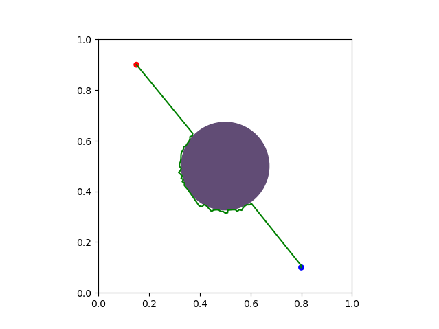
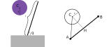
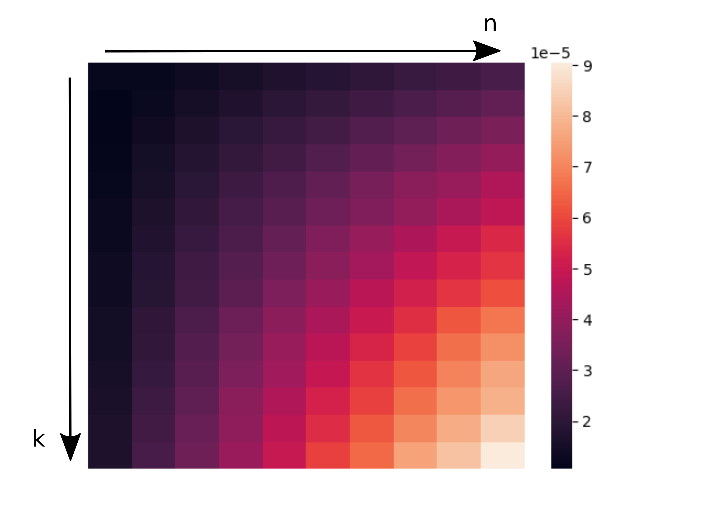

I made an [RRTConnect][planner] path planner but only used an obstacle in the configuration space.



It was convenient for testing the planner but usually we do not know where the obstacles are located in the configuration space. Instead, we observe the obstacles in the robot workspace and they implictly define invalid states in the configuration space. In this post we will begin the work to implement a realistic collision checking function.

Let's model a robot with only one link of length $l$ and a joint $q$. We attach one end of the link at $(0, 0)$ and the other end will be at $(l \cos(q), l \sin(q))$. We also create a round obstacle of radius $r$ and center $C$.



 We want to know if the robot is a in a valid state for a certain value $q$. It is equivalent to know if the circle intersect our link. The figure on the right defines our circle-line segment collision problem. There is a collision if we are in at least one of the following conditions:
 + If A or B are inside the circle 
 + If $|CH|\le r$ and H is between A and B.

# The code
We would like our collision checker to handle multiple line segments and multiple circles in one call. We name our collision function `ColSegmentsCircles` and make it dyadic with:
+ `𝕩` containing the line segment informations. Each line segment will be represented by two points (A and B) of two coordinates each, thus `𝕩≢n‿2‿2` with $n$ the number of line segments to be tested.
+ `𝕨` containing the positions of the circle centers (C points) and their radius. We get `𝕨≢⟨k‿2, k⟩` with $k$ the number of circles in the workspace. 

The first thing we do is to define a dot product `Dot ← +´∘×`. A useful property is that the square of the norm of a segment $[P_1 P_2]$ is equal to the dot product of the segment with itself:
$$|P_1 P_2|^2 = \langle P_1 P_2 , P_1 P_2\rangle$$

We can translate the previous collision conditions into math:
+ $|CA|^2\le r^2$ or $|CB|\le r^2$
+ $|CH|^2\le r^2$ and $\langle CA , CB\rangle \le 0$. 

Our function begins with some helpful variables:
```
Dot ← +´∘×

ColSegmentsCircles ← { 
 [a,b] ← 1⍉𝕩 ⋄ c‿r ← 𝕨 ⋄ r_squared ← r⋆2 
 ca  ← {𝕩 -⎉1 c}⎉1 a ⋄ cb  ← {𝕩 -⎉1 c}⎉1 b
}
```

The first step is to check if one of the line segment endpoints (A or B) is inside at least one of the circles. Please note that we operate directly on 𝕩. 

```
col ← {∨´⎉1}⍟2 r_squared≥⎉1 Dot˜⎉1 {𝕩 -⎉1 c}⎉1 𝕩 
```

The second collision condition requires to compute the distance $|CH|$ where H is the projection of C into the line $(AB)$. We will use the formula from this [stackoverflow answer][projection-equation]. For each line segment we need a vector $\vec{n}$ orthogonal to the vector $\vec{AB} = (\alpha, \beta)$. A simple candidate is $\vec{n}=(-\beta, \alpha)$. We compute $n$ for each line using: 

```
n   ← (-⌾⊑)∘⌽˘ b-a
```

The distance $|CH|$ could be obtained through the equation $|CH|^2 = \frac{(\vec{CA} \cdot \vec{n})^2}{l^2}$. 

```
d_squared ← (2⋆˜ n {𝕨 Dot⎉1 𝕩}˘ ca ) ÷ Dot˜˘ b-a 
```

We named the distance $|CH|$ *d_squared* in our code. We have a collision if $|CH|^2<r^2$ and if H is between A and B. To check where H is placed we can use the fact that H is between A and B if and only if $ \langle CA , CB\rangle \le 0$.

```
∨´˘  (0 ≥ ca Dot˘˘ cb) ∧ {r_squared ≥¨ 𝕩}˘ d_squared
```

Our final program is:

```
Dot ← +´∘×

# 𝕩≢n‿2‿2    𝕨≢⟨k‿2, k⟩
ColSegmentsCircles ← { 
 [a,b] ← 1⍉𝕩 ⋄ c‿r ← 𝕨 ⋄ r_squared ← r⋆2 
 ca  ← {𝕩 -⎉1 c}⎉1 a ⋄ cb  ← {𝕩 -⎉1 c}⎉1 b
 
 col ← {∨´⎉1}⍟2 r_squared≥⎉1 Dot˜⎉1 {𝕩 -⎉1 c}⎉1 𝕩
 n   ← (-⌾⊑)∘⌽˘ b-a
 d_squared ← (2⋆˜ n {𝕨 Dot⎉1 𝕩}˘ ca ) ÷ Dot˜˘ b-a 
 col ↩ col ∨˘ ∨´˘  (0 ≥ ca Dot˘˘ cb) ∧ {r_squared ≥¨ 𝕩}˘ d_squared
}
```

# Testing
I used [geogebra][geogebra-site] to draw some lines and circles. Then, I wrote the points positions and circle radius values in my code and made a test to verify that the code performs correctly.

```
points  ← [[⟨-10,   4⟩, ⟨-8, -6⟩],
           [⟨-10,  -2⟩, ⟨ 2, -2⟩],
           [⟨ -4, -10⟩, ⟨ 4, -6⟩],
           [⟨ -2,   0⟩, ⟨ 2, -8⟩],
           [⟨ -6,   2⟩, ⟨10, -2⟩],
           [⟨ -6,   8⟩, ⟨-4,  6⟩],
           [⟨ -4,   4⟩, ⟨ 4,  2⟩],
           [⟨ -2,   2⟩, ⟨-2,  6⟩],
           [⟨  0,   4⟩, ⟨ 4,  8⟩],
           [⟨  0,   8⟩, ⟨12,  8⟩],
           [⟨  6,  10⟩, ⟨12, -2⟩],
           [⟨ -8, -10⟩, ⟨10, 10⟩]]
	   
circle_centers ← [⟨-4,-4⟩, ⟨6,-4⟩, ⟨8,4⟩, ⟨2,2⟩, ⟨-6,6⟩]
radius         ← ⟨  4,      2,      4,     1.2,    1.2⟩

expected ← 0‿1‿0‿1‿0‿0‿1‿0‿0‿1‿1‿1
test_result ← ∧´ expected = ⟨circle_centers, radius⟩ ColSegmentsCircles points
```

And it worked!! 

# Benchmarking
The collision checker will be the bottleneck of the path planners so it is important to make the code as fast as possible. For now I did not do anything special to optimize it but it will be a very high priority task. 

I made a small benchmark code using the `•_timed` function described [here][benchmark-function]. It outputs the time spent averaged over 10000 iterations for different number of randomly generated line segments and circles.

```
Benchmark ← {
  n ← 𝕩 ⋄ k ← 𝕨
  points  ↩ 10 × n‿2‿2 •rand.Range 0  
  circle_centers ↩ 10 × k‿2 •rand.Range 0
  radius ↩ 10 × k •rand.Range 0
  10000 ⟨circle_centers, radius⟩⊸ColSegmentsCircles•_timed points
}

•Show (1+↕15) Benchmark⌜ (1↕10)
```

The following is a heatmap of the time recorded for each value of $n$ and $k$.



We go from around 12µs for $n=k=1$ to around 90µs for $n=10$ and $k=15$.

# Conclusion

It was relatively simple to write the collision checker function for a unique line segment and only one circle. However, when I wanted to extend it to multiple dimensions it was (and still is!) very difficult. I am still struggling with `˘` and `¨`. With the help of dzaima on Discord I discovered the use of `⎉`. I do not understand it completely yet but I am getting there!

I am quite happy that I successfully implemented a multi-query collision check. It should be useful in the future. The current performance is not very good I think (I need more data to be certain) and I am pretty sure that we can optimize it but for a first try it is not too bad.

[planner]: https://github.com/thibaultbarbie/bqn-planner
[projection-equation]: https://math.stackexchange.com/a/4088608
[geogebra-site]: https://www.geogebra.org
[benchmark-function]: https://mlochbaum.github.io/BQN/implementation/perf.html#performance-resources 
