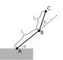
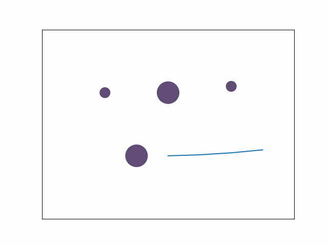

If we model a robot as multiple links connected all together through rotating joints we get something like the following figure.



For simplicity the robot is represented with only two links but the following equations could be generalized to robot with more links. The robot is connected to the ground in A which we will define as $(0, 0)$. The length of each link will be represented by $l_1$, $l_2$ and so on. Every joint has an angle defined as $q_1$, $q_2$ ...

Using simple trigonometry we get the position of B.
$$B=(l_1 \cos q_1, l_1\sin q_1)$$
With the same formula we can obtain the position of C using the position of B.
$$C=(l_1 \cos q_1 + l_2 \cos (q_1+q_2), l_1 \sin q_1 + l_2 \sin (q_1+q_2))$$

We can generalize it to the *i*-th point $P_i$ with the formula
$$P_i=(l_1 \cos q_1 + ... + l_i \cos (q_1+...+ q_i), l_1 \sin q_1 + ... + l_i \sin (q_1+...+ q_i))$$

Going from the vector of angles **q** $= (q_1, q_2, ...)$ to the coordinates of the points $A$, $B$, $C$, ... is called *forward kinematics*. Here is an implementation in BQN.

```
FK ← {
 l‿q ←𝕩 ⋄ a ← +`˘ q
 x ← ∾˝ (2↕(0˙∾+`))˘ l ע •math.Cos a
 y ← ∾˝ (2↕(0˙∾+`))˘ l ע •math.Sin a
 x≍y
}
```

I am sure that I can compress the expression more or even make it tacit but it is good enough for a first implementation. This FK function outputs a list of pair of points delimiting the links of the robot. If we combine it with the collision checker of [a previous post][col] you can compute if a specific vector of angle **q** will make the robot collide with an obstacle or not. 

Finally, if we combine it with the [RRTConnect planner][planner] I made we can find a path in the workspace while avoiding some round obstacles.




[planner]: https://github.com/thibaultbarbie/bqn-planner
[col]: https://thibaultbarbie.github.io/posts/post-2/
